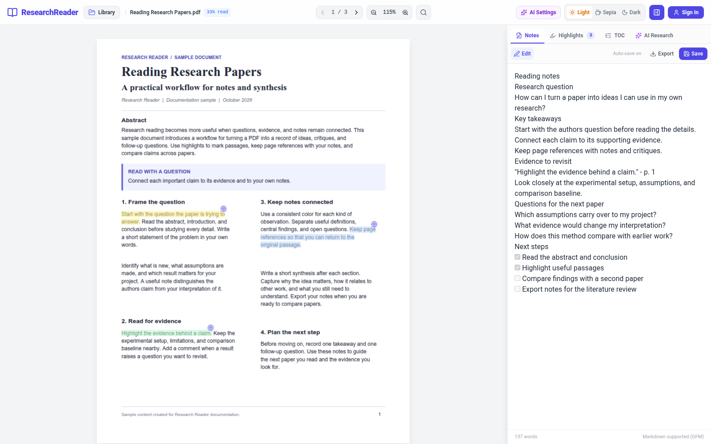
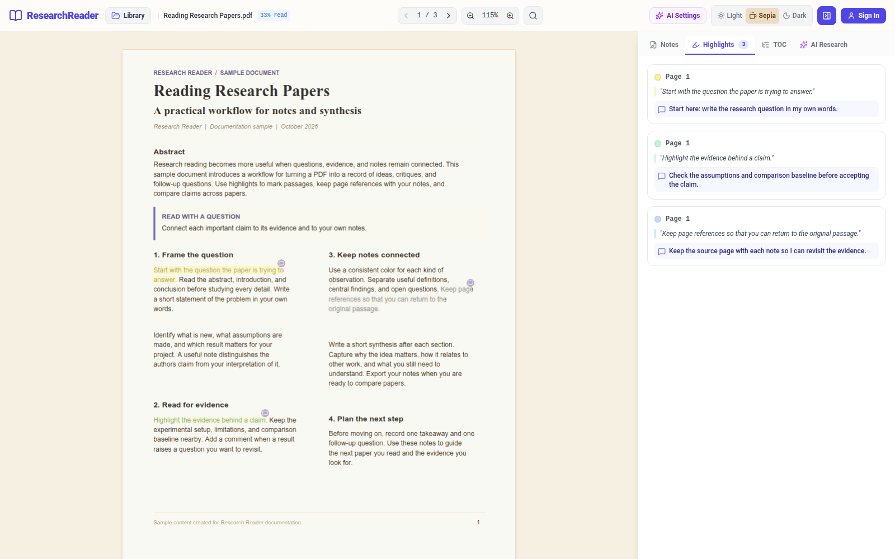
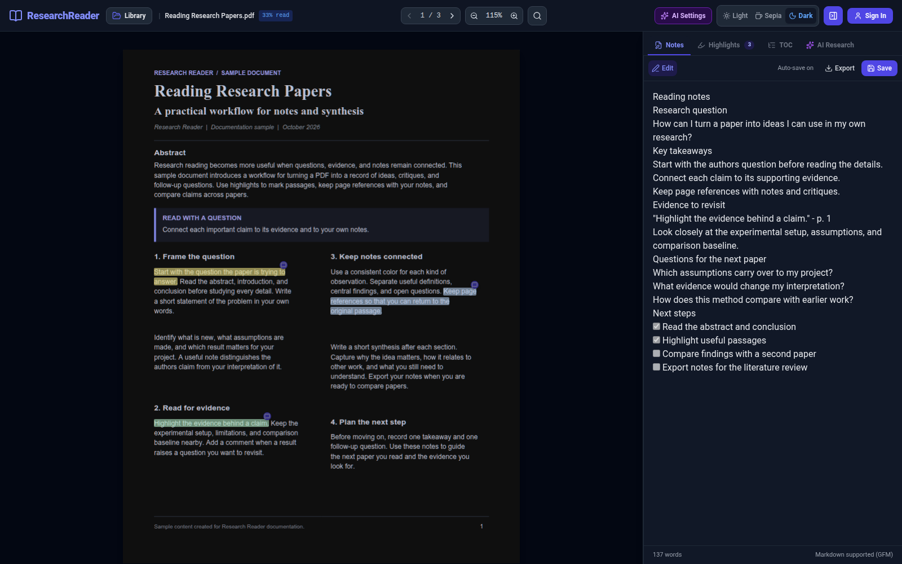
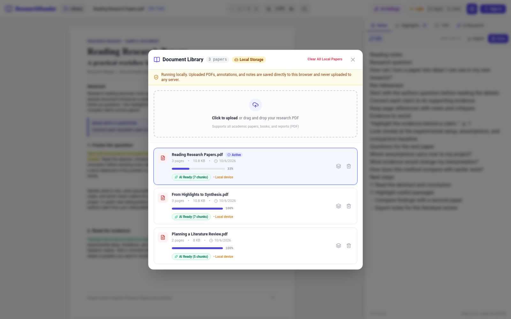

# Research Reader

Read research papers, highlight evidence, and keep Markdown notes beside your PDF. Research Reader brings together a document library, a focused reading workspace, and optional AI tools for exploring a paper.




## Features

- **Read and write side by side.** Edit or preview Markdown notes while your PDF stays open. Notes save automatically; a failed save preserves the draft in the editor and offers Retry.
- **Highlight and comment.** Mark passages in six colors and attach comments. Jump from a sidebar annotation to the source passage, or open a note from its badge on the page.
- **Navigate long papers.** Search the document, move between matches, and use its table of contents when the PDF includes bookmarks.
- **Keep a document library.** Upload PDFs, switch papers, and track your last page and reading progress.
- **Choose a reading theme.** Switch between light, sepia, and dark modes, and adjust the PDF zoom.
- **Export your notes.** Download Markdown containing your notes, extracted highlights, comments, and page references.
- **Explore with AI.** Explain selected text, ask questions about a paper, generate summaries, and create follow-up literature queries using a supported cloud provider or local Ollama model.
- **Start without an account.** The core reader, notes, and annotations work in guest mode with browser storage.

## Screenshots

These screenshots were captured from the running app using sample documents and demo notes created for this repository.

### Highlights and comments in sepia mode

Review colored highlights and comments beside the original passage.



### Dark reading mode

Read the same paper and notes with the dark theme.



### Document library

Switch between papers and review their reading progress and indexing status.



## Quick start: browser-only reader

Requires **Node.js 22.12 or newer** and npm.

```bash
git clone https://github.com/romit-23/research-reader.git
cd research-reader/frontend
npm ci
npm run dev
```

Open **http://localhost:5173**, select **Library**, and upload a PDF. Reading, highlights, comments, notes, and Markdown export work without a backend in guest mode.

Guest PDFs, notes, and annotations are stored in your browser using IndexedDB. They stay in the browser where you uploaded them; export important notes before clearing site data. Accounts and AI features require the backend below.

## Full setup: accounts and AI

Also requires **Python 3.10 or newer**. Run the frontend and backend in separate terminals.

### 1. Prepare the backend

From the repository root, on macOS or Linux:

```bash
python3 -m venv venv
source venv/bin/activate
python -m pip install -r backend/requirements.txt
cp backend/.env.example backend/.env
```

On Windows PowerShell:

```powershell
python -m venv venv
.\venv\Scripts\Activate.ps1
python -m pip install -r backend/requirements.txt
Copy-Item backend/.env.example backend/.env
```

Edit `backend/.env` and replace `SECRET_KEY` with a random value for your installation. Environment files are excluded from Git.

With the Python environment active:

```bash
cd backend
python run.py
```

The API runs at **http://localhost:8000**. Interactive API documentation is available at **http://localhost:8000/docs**, and **http://localhost:8000/health** reports its health. The default database is SQLite; the application creates its storage directory and database tables on startup.

### 2. Start the frontend

In a second terminal, from the repository root:

```bash
cd frontend
npm ci
npm run dev
```

The frontend connects to `http://localhost:8000` by default. To use another API host, create `frontend/.env.local` and restart the frontend:

```dotenv
VITE_API_URL=http://localhost:8000
```

### 3. Configure AI

Open **AI Settings** in the reader and choose a provider, model, and API key where required. Supported providers are **Gemini, OpenAI, Anthropic, Groq, DeepSeek, and Ollama**.

For local models, run Ollama separately with an installed model. Set the Ollama URL in AI Settings; the default is `http://localhost:11434`.

Server-side defaults can also be configured in `backend/.env`:

| Setting | Purpose |
| --- | --- |
| `GEMINI_API_KEY`, `OPENAI_API_KEY`, `ANTHROPIC_API_KEY`, `GROQ_API_KEY`, `DEEPSEEK_API_KEY` | Optional server-side provider keys |
| `OLLAMA_BASE_URL` | Local Ollama endpoint |
| `ENVIRONMENT` | `prod` for the cloud-provider default; `local` for the Ollama default |
| `DATABASE_URL` | SQLite or PostgreSQL connection string |
| `SECRET_KEY` | Signing secret for account sessions |
| `ADMIN_EMAILS` | Comma-separated account emails with admin access |

See [backend/.env.example](backend/.env.example) for the complete configuration template.

## Reading workflow

1. Open **Library** and upload a PDF.
2. Select a passage to highlight it, add a comment, search Google, or request an AI explanation.
3. Write your takeaways in **Notes** and use **Preview** to view rendered Markdown.
4. Open **Highlights** to revisit passages and edit comments.
5. Use **TOC** for PDFs with bookmarks, or **Ctrl+F / Cmd+F** to search the paper. **Enter** moves to the next match; **Shift+Enter** moves to the previous match.
6. Select **Export** in the notes toolbar to download your notes and annotations as Markdown.

## Technology

| Layer | Stack |
| --- | --- |
| Frontend | React 19, TypeScript, Vite 8, Tailwind CSS, Lucide icons |
| PDF rendering | Mozilla PDF.js |
| Notes | React Markdown with GitHub Flavored Markdown support |
| Guest storage | Browser IndexedDB |
| Backend | FastAPI, SQLAlchemy, Pydantic, Uvicorn |
| Database | SQLite by default; PostgreSQL configuration supported |
| Accounts | JWT authentication and password hashing |
| AI | Configurable cloud providers and local Ollama |

## Project structure

```text
research-reader/
├── frontend/
│   ├── src/components/   # Reader, library, notes, annotations, and AI UI
│   ├── src/api/          # API client and provider settings
│   └── src/utils/        # PDF worker, search, and browser storage
├── backend/
│   ├── app/api/          # Documents, accounts, notes, annotations, and AI routes
│   ├── app/database/     # Models and database sessions
│   ├── app/services/     # Document chunking and AI providers
│   └── alembic/          # Database migrations
└── docs/screenshots/     # Screenshots used in this README
```

## Development commands

Run these from `frontend/`:

```bash
npm run dev       # Start the development server
npm run build     # Type-check and create the production build
npm run preview   # Preview the built frontend locally
npm run lint      # Run Oxlint
```
